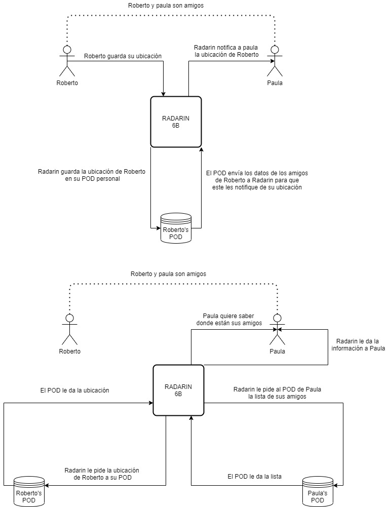

[[section-system-scope-and-context]]
== System Scope and Context

[role="arc42help"]
****
.Motivation
La meta de la aplicación es crear un sistema para facilitar encuentros entre amigos utilizando nuevas tecnologías. La aplicación podrá acceder a la información de localización del teléfono móvil de los usuarios que voluntariamente la tengan activada y permitirá que otros usuarios que sean sus amigos puedan conocer cuándo están cerca (notificándoles para que puedan entrar en contacto)

.Contents
Este sistema será compatible con SOLID.
Usando la tecnología SOLID y los PODs de SOLID, el sistema no almacenará información personal de los usuarios de forma centralizada, permitiendo que los usuarios se comuniquen entre ellos de una manera segura y eficaz.

.Caso de uso
Diagrama de dos personas usando la aplicación:

****

=== Business Context

[role="arc42help"]
****
[cols="^.^2,^.^3,^.^3"] [cols=3*,options="header"]
.Business Context
|===
|Nombre
|Inputs
|Outputs

|Usuarios
|Reciben la ubicación de sus amigos
|Emiten su ubicación, eligen quienes son sus amigos.

|Aplicación
|Recibe ubicaciones de los usuarios y de los PODs, y también puede recibir listas de amigos
|Comparte ubicaciones o las guarda en los PODs correspondientes

|PODs
|Recibe peticiones para que envíe información, y recibe ubicaciones y amigos para guardar.
|Comparte información con la aplicación

****

=== Technical Context

[role="arc42help"]
****
.Herramientas y Framworks utilizados
Como mencionamos anteriormente, la aplicación utilizará *SOLID* para la comunicación.
Para el desarrollo utilizaremos *React*, una librería de código abierto de JavaScript, que nos facilitará crear interfaces de usuario.
También utilizaremos *JavaScript* para el desarrollo de la aplicación.

****
